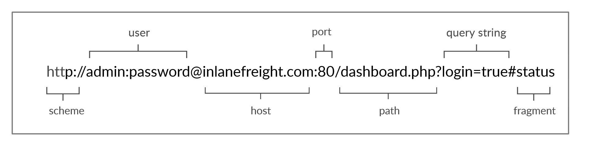

## HTTP

**Note**: the default port for HTTP communication is port 80

### URL

| Component    | Example           | Description    |
|--------------|-------------------|----------------|
| Scheme       | http:// https://  | This is used to identify the protocol being accessed by the client, and ends with a colon and a double slash (://) |
| User Info    | admin:password@   |	This is an optional component that contains the credentials (separated by a colon :) used to authenticate to the host, and is separated from the host with an at sign (@) |
| Host         | inlanefreight.com |	The host signifies the resource location. This can be a hostname or an IP address |
| Port         | :80               | The Port is separated from the Host by a colon (:). If no port is specified, http schemes default to port 80 and https default to port 443 |
| Path         | /dashboard.php    | This points to the resource being accessed, which can be a file or a folder. If there is no path specified, the server returns the default index (e.g. index.html). |
| Query String | ?login=true       | The query string starts with a question mark (?), and consists of a parameter (e.g. login) and a value (e.g. true). Multiple parameters can be separated by an ampersand (&). |
| Fragments    | #status           | Fragments are processed by the browsers on the client-side to locate sections within the primary resource (e.g. a header or section on the page). |

The main mandatory fields are the scheme and the host, without which the request
would have no resource to request.

### HTTP Flow

1. the browser asks the DNS the IP address of the given URL
2. the DNS returns the IP address
3. The browser sends a HTTP request to the server in IP address
4. The server will responde back

**Note**: Our browsers usually first look up records in the local '/etc/hosts' file,
and if the requested domain does not exist within it, then they would contact
other DNS servers. We can use the '/etc/hosts' to manually add records to for
DNS resolution, by adding the IP followed by the domain name.

## HTTPS
To counter the Man-in-the-middle problem that the HTTP has, the HTTPS (HTTP
Secure) protocol was created, in which all communications are transferred in an
encrypted format, so even if a third party does intercept the request, they
would not be able to extract the data out of it. For this reason, HTTPS has
become the mainstream scheme for websites on the internet, and HTTP is being
phased out, and soon most web browsers will not allow visiting HTTP websites.

HTTP requests are sent in clean, so if it is intercepted, all the information
will be visible by all; even username and password data.

In contrast, an HTTPS request is enctrypted and all the data are passed through
a encrypted string. So, no information is leaked.

### HTTPS Flow

If we type http:// instead of https:// to visit a website that enforces HTTPS,
the browser attempts to resolve the domain and redirects the user to the
webserver hosting the target website. A request is sent to port 80 first, which
is the unencrypted HTTP protocol. The server detects this and redirects the
client to secure HTTPS port 443 instead. This is done via the 301 Moved
Permanently response code, which we will discuss in an upcoming section.

Next, the client (web browser) sends a "client hello" packet, giving information
about itself. After this, the server replies with "server hello", followed by a
key exchange to exchange SSL certificates. The client verifies the
key/certificate and sends one of its own. After this, an encrypted handshake is
initiated to confirm whether the encryption and transfer are working correctly.

Once the handshake completes successfully, normal HTTP communication is
continued, which is encrypted after that. This is a very high-level overview of
the key exchange, which is beyond this module's scope.

